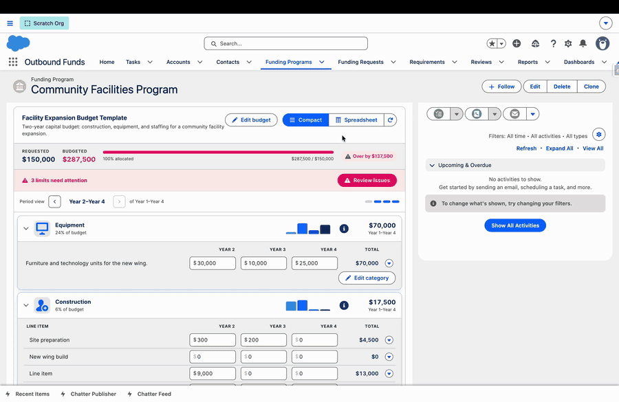

# Flow Tool Kit: Universal Budget

One Lightning web component that renders an editable, validating budget matrix on top of **any** object model you map to it. Categories become rows, periods become columns, and each cell is an inline-editable value with live limit validation.

The same component works on three kinds of data model out of the box:

- **NPC Grantmaking** — the standard Nonprofit Cloud Budget objects.
- **Outbound Funds** — a bundled custom budget tree (Budget, Category, Period, Value).
- **Your own objects** — map four objects you already own and the grid renders against them, no code.

What makes it "universal" is a single `Budget_Configuration__mdt` record that tells the component which objects and fields are your budget, categories, periods, and values. Change the mapping, point it at a different data model, and the same grid renders.

> **Try it live** — public demo, no login:
> - [Facility Expansion Budget Template](https://common-unite.my.site.com/s/budget/a0tRQ00000YpZ3PYAV/facility-expansion-budget-template) — the editable grid as a guest preview (change values and add line items; edits reset on refresh).
> - [Year 2 reporting window](https://common-unite.my.site.com/s/budget/a0rRQ00000pF7dPYAS/year-2) — reporting mode: budgeted vs. actual vs. variance.

## Start here

- [Quickstart](getting-started/quickstart.md) — from install to a live grid in a few steps.
- [Installation](getting-started/installation.md) — package install, permission sets, and licensing.

## Features

- [The Budget Grid & Value Modes](features/budget-grid-and-modes.md) — compact and spreadsheet views, inline editing, line items, and the currency / quantity / percent modes.
- [Limits, Validation & Reporting](features/limits-validation-and-reporting.md) — minimums, maximums, percentage caps, the advisory system, and reporting mode (budget vs. actuals).
- [Templates & Cloning](features/templates-and-cloning.md) — reusable budget templates and the Clone Budget action.

## Configuration

- [Mapping Your Data Model](configuration/mapping-your-data-model.md) — the `Budget_Configuration__mdt` record that binds the grid to your objects and fields.

## Integrations

- [Forms, Flow & Experience Cloud](integrations/forms-flow-and-experience-cloud.md) — the Form Builder edit modals, the Flow screen contract, and Experience Cloud (including the guest interactive preview).

---

Requires the free Flow Tool Kit base package. The Universal Budget is a paid feature: it runs open in sandboxes, scratch orgs, and Developer Editions, and requires purchase for production use. Contact Common-Unite.
