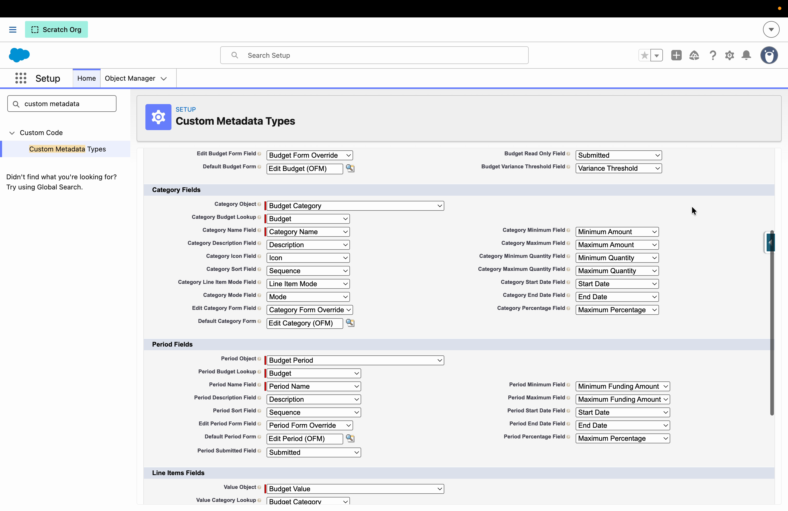
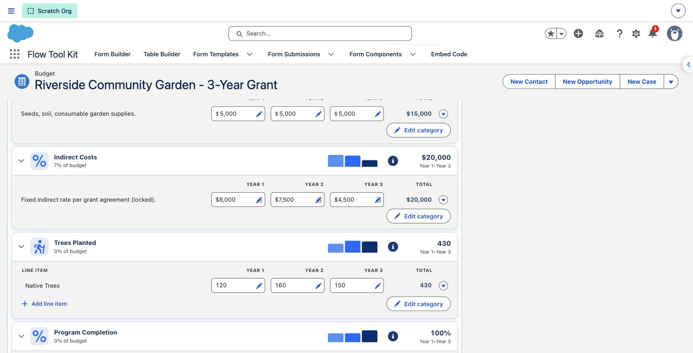
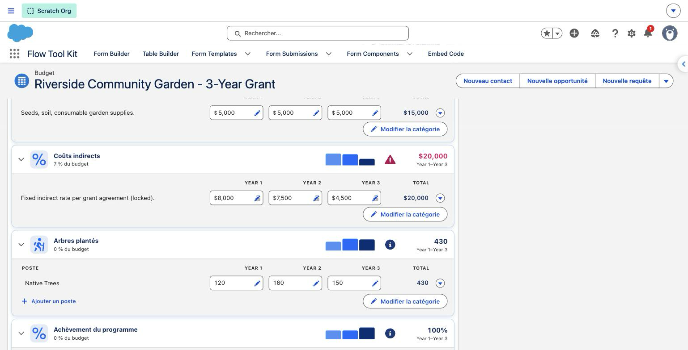

# Mapping Your Data Model

The component knows nothing about your objects until a **`Budget_Configuration__mdt`** record tells it which objects and fields are your budget, categories, periods, and values. That one record is what lets the same grid run on NPC Grantmaking, Outbound Funds, or objects you built yourself.

You don't write this from scratch — the bundled **NPC** and **Outbound Funds** configuration records are complete, working examples. Clone one and repoint the fields, or read it to see how a real mapping looks.

## The four objects

A budget is four objects in a hierarchy: a **budget** owns **categories** (rows) and **periods** (columns), and each **value** (cell) belongs to a category and, usually, a period.

| Field | Points at |
| --- | --- |
| `Budget_Source_Object__c` | The budget object (the record the grid loads). |
| `Category_Object__c` | The category (row) object. |
| `Period_Object__c` | The period (column) object. |
| `Value_Object__c` | The value (cell) object. |

### Relationships

| Field | The lookup that connects... |
| --- | --- |
| `Category_Budget_Lookup__c` | Category → its budget. |
| `Period_Budget_Lookup__c` | Period → its budget. |
| `Value_Category_Lookup__c` | Value → its category. |
| `Value_Period_Lookup__c` | Value → its period (leave a value periodless for categories-only budgets). |

## Budget fields

| Field | Maps to the budget's... |
| --- | --- |
| `Budget_Name_Field__c` | Name shown in the header. |
| `Budget_Description_Field__c` | Description/subtitle. |
| `Budget_Amount_Field__c` | Total budgeted amount. |
| `Budget_Requested_Amount_Field__c` | Requested amount (usually the grant/request total). |
| `Budget_Min_Field__c` / `Budget_Max_Field__c` | Overall minimum and maximum limits. |
| `Budget_Read_Only_Field__c` | A field (often a formula) that, when true, makes the whole grid read-only. |
| `Budget_Variance_Threshold_Field__c` | Variance threshold percent used in reporting mode. |
| `Budget_Actuals_Mode_Field__c` | Actuals mode picklist, `Direct` or `Allocation`; blank means Direct. See [Claims & Allocation Mode](../features/claims-and-allocation-mode.md). |
| `Budget_Start_Date_Field__c` / `Budget_End_Date_Field__c` | The budget's own date window. Blank shows every period; mapped, periods outside the window are hidden only while they hold no non-zero figures. See [Scoping periods with budget dates](../features/budget-grid-and-modes.md#scoping-periods-with-budget-dates). |
| `Budget_Has_Violations_Field__c` / `Budget_Violation_Count_Field__c` / `Budget_Violation_Details_Field__c` | Fields the package stamps with the grid's violation state (checkbox, number, long text: one breach per line). Blank disables stamping. See [Violations as data on the budget](../features/limits-validation-and-reporting.md#violations-as-data-on-the-budget). |

## Category fields

| Field | Maps to the category's... |
| --- | --- |
| `Category_Name_Field__c` / `Category_Description_Field__c` | Name and description. |
| `Category_Icon_Field__c` | SLDS icon name. |
| `Category_Sort_Field__c` | Display order (sequence). |
| `Category_Mode_Field__c` | Value mode (currency / quantity / percent). |
| `Category_Line_Item_Mode_Field__c` | Whether the category holds line items. |
| `Category_Min_Field__c` / `Category_Max_Field__c` | Amount limits. |
| `Category_Percentage_Field__c` | Maximum percentage of the total budget. |
| `Category_Min_Quantity_Field__c` / `Category_Max_Quantity_Field__c` | Quantity limits. |
| `Category_Start_Date_Field__c` / `Category_End_Date_Field__c` | Dates that scope which periods the category applies to. |
| `Category_Not_Fundable_Field__c` | A checkbox marking the exception: a category the funder does not pay (a match, other funding sources). Checked categories stay on the authoring grid, leave the reporting and claim sheets, and never reach a disbursement amount. Unmapped or unchecked means fundable. |
| `Category_Requires_Receipt_Field__c` | A checkbox marking categories whose claim lines need a receipt. Rows of checked categories show an attachment icon in place of the edit pencil on the claim sheet; it opens the same mapped edit form, where the file upload field belongs. Unmapped or unchecked keeps the ordinary pencil. |
| `Category_Requires_Estimate_Field__c` | The authoring-side sibling: a checkbox marking categories whose budget lines need a quote or estimate. Cells of checked categories show an attachment icon in place of the edit pencil on the authoring grid, opening the same mapped value edit form. |

## Period fields

| Field | Maps to the period's... |
| --- | --- |
| `Period_Name_Field__c` / `Period_Description_Field__c` | Name and description. |
| `Period_Sort_Field__c` | Display order (sequence). |
| `Period_Min_Field__c` / `Period_Max_Field__c` | Funding limits for the period. |
| `Period_Percentage_Field__c` | Maximum percentage for the period. |
| `Period_Start_Date_Field__c` / `Period_End_Date_Field__c` | Period date range. |
| `Period_Submitted_Field__c` | The flag that locks the period in reporting mode (the component reads it, never writes it). |

## Value fields

| Field | Maps to the value's... |
| --- | --- |
| `Value_Amount_Field__c` / `Value_Quantity_Field__c` / `Value_Percent_Field__c` | The planned figure, one per mode. |
| `Value_Actual_Amount_Field__c` / `Value_Actual_Quantity_Field__c` / `Value_Actual_Percent_Field__c` | The actual figure entered in reporting mode. |
| `Value_Name_Field__c` | Line item name. |
| `Value_Grouping_Identifier_Field__c` | Groups the cells of one line item across periods. |
| `Value_Fixed_Field__c` | Marks a cell fixed so split-evenly and fills skip it. |
| `Value_Estimate_FileUpload_Field__c` | Long text the file upload field in your value edit form writes for estimates. The authoring grid lights a cell's icon once files are there, and a Requires Estimate category flags a money line that has none. See [Attachments on line items](../features/budget-grid-and-modes.md#attachments-on-line-items). |
| `Value_Receipt_FileUpload_Field__c` | The same for receipts, read by Direct reporting sheets. Allocation mode reads the claim line's own upload field instead, since a receipt belongs to the claim. |

## Disbursement fields (optional role)

Map these and the grid opens from a disbursement record, showing that disbursement's period. Leave them blank and nothing changes.

| Field | Points at / maps to |
| --- | --- |
| `Disbursement_Object__c` | The disbursement object (NPC: `FundingDisbursement`). |
| `Disbursement_Period_Lookup__c` | Disbursement → its period. A disbursement without it cannot open the grid. |
| `Disbursement_Amount_Field__c` | The amount the package keeps in agreement with the lines that produced it. |
| `Disbursement_Name_Field__c` | The name shown in the sheet header. |
| `Disbursement_Submitted_Field__c` | The boolean that locks the sheet opened from this disbursement (read, never written). |

## Allocation fields (optional role)

Map these, and set a budget's actuals mode to `Allocation`, to turn the sheet opened from a disbursement into a claim sheet.

| Field | Points at / maps to |
| --- | --- |
| `Allocation_Object__c` | The allocation (claim line) object (NPC: `BudgetAllocation`). |
| `Allocation_Value_Lookup__c` | Allocation → the value (cell) it claims against. |
| `Allocation_Disbursement_Lookup__c` | Allocation → the disbursement (claim) it belongs to. |
| `Allocation_Budget_Lookup__c` | Allocation → the budget, filled on create (required on NPC). |
| `Allocation_Amount_Field__c` / `Allocation_Quantity_Field__c` | The claimed amount, and the claimed quantity for quantity-mode lines. Line money is amount times quantity; a money line writes quantity one. |
| `Allocation_Name_Field__c` | The line's name, filled from the value's name on create. |
| `Allocation_FileUpload_Field__c` | The same for the claim line: the claim sheet's action icon lights once the allocation holds files (a receipt, a timesheet). |

## Edit forms

Structure editing happens through Flow Tool Kit **forms**, so you control exactly which fields an admin or grantee edits per object — and even per budget.

| Field | Purpose |
| --- | --- |
| `Default_Budget_Form__c` / `Default_Category_Form__c` / `Default_Period_Form__c` / `Default_Value_Form__c` | The org-default edit form for each object. |
| `Edit_Budget_Form_Field__c` / `Edit_Category_Form_Field__c` / `Edit_Period_Form_Field__c` / `Edit_Value_Form_Field__c` | The field *on the budget* that names a form to use instead of the default — so different budgets can offer different edit forms. |
| `Default_Allocation_Form__c` / `Edit_Allocation_Form_Field__c` | The same pair for the allocation (claim line) form the pencil on a claim-sheet cell opens. |

See [Forms, Flow & Experience Cloud](../integrations/forms-flow-and-experience-cloud.md) for building those forms.

## Translating configured text

Every mapping the grid shows as text is read with `toLabel()` when the mapped field is a picklist, so
Translation Workbench translates it for each user. That is the name and description mappings on every
role: `Budget_Name_Field__c`, `Category_Name_Field__c`, `Period_Name_Field__c`, `Value_Name_Field__c`,
`Disbursement_Name_Field__c`, and the three description fields. Text, text area and formula fields read
as they are. The grid, the reporting sheet and the claim sheet all inherit the label.

The pattern this is built for: a **Category picklist** on the category object with a translation per
value, mapped as `Category_Name_Field__c`, plus your own record-triggered Flow that copies the picklist
value into the record's Name so list views and reports still read well. The package never writes the
picklist; your Flow owns the Name.

What stays untranslated, on purpose:

- **Mappings the package branches on** are always read by value: `Category_Mode_Field__c`,
  `Budget_Actuals_Mode_Field__c`, `Category_Line_Item_Mode_Field__c`, the submitted, fixed, not-fundable,
  requires-estimate and requires-receipt flags. A translated mode would break the branch that reads it.
  `Category_Icon_Field__c` is a key the grid resolves to an icon, not text, so it is read by value too.
- **Sorting.** SOQL cannot order by a label, so a picklist name sorts in the picklist's own definition
  order: the order you arrange the values in Setup, the same for every language. Map a sort field when you
  want an explicit order.
- **The violation stamp** (`Budget_Violation_Details_Field__c`) names categories and periods by their stored
  value. The stamp is written in the org default language for the grantmaker, reports and Flows to read,
  and a picklist label can only be fetched in the saving user's language, so the value keeps it consistent.
- **A field mapped as both a display and a logic mapping** is read by value.
- **`Value_Name_Field__c` as a picklist is display-only.** Line names on the grid are typed free text, so a
  picklist there shows its label but cannot be edited from the grid; use the value edit form for that.

## Tips

- Start from a bundled config and change the object and field names rather than building blank.
- A field you leave blank is simply a capability the grid won't show — no maximum field means no maximum limit, no icon field means no category icons.
- `Value_Period_Lookup__c` is the one relationship you can leave off, for categories-only ("periodless") budgets.
- The disbursement and allocation roles are optional and independent: map the disbursement role alone for a second door into Direct-mode actuals plus a derived disbursement amount; map both for claims.
