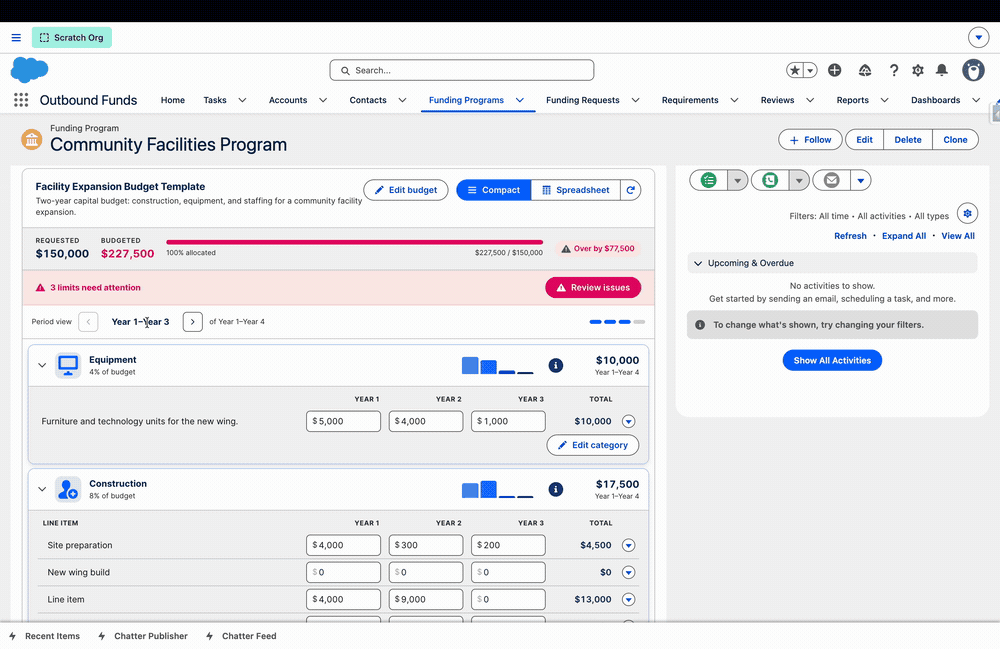
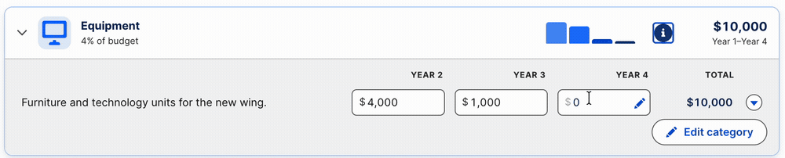
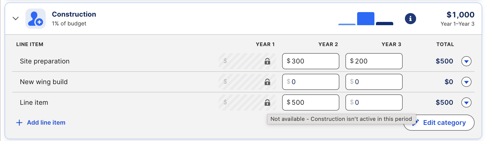
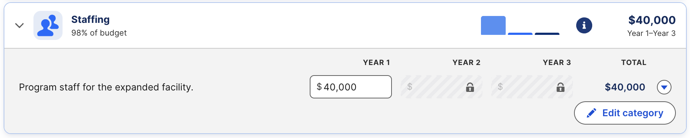
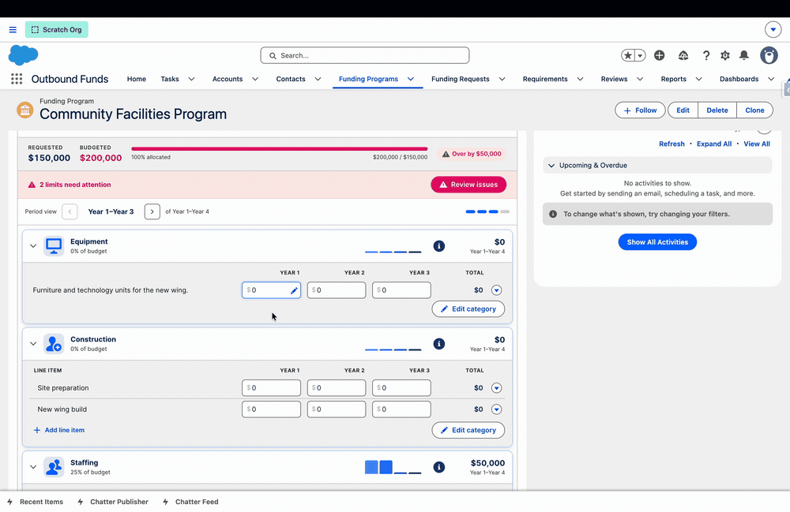
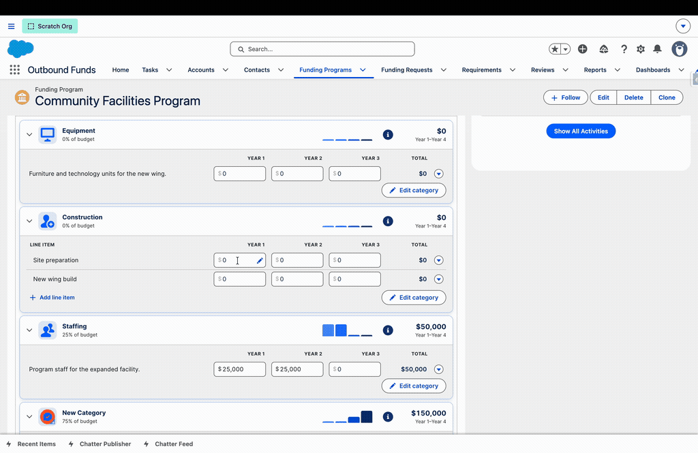

# The Budget Grid & Value Modes

The grid lays categories out as rows and periods as columns. Every intersection is a value cell. This page covers how people read and edit the grid day to day.

## Compact and spreadsheet views

Toggle between two layouts with the **Compact / Spreadsheet** switch in the header.

- **Compact** — each category is a collapsible card showing its line items, a spend bar, and its total. Best for reading a budget and working one category at a time.
- **Spreadsheet** — a dense table with periods as columns and a totals row, closest to a classic budget worksheet. Best for entering many numbers quickly.

Both views share the same paginator: when a budget has more than three periods, the extra columns page rather than crowd the screen, so a monthly or quarterly budget stays readable.

## Entering values

Type directly into a cell and it saves as you go, with per-cell save sequencing so a slow save can never overwrite a newer edit. A spend bar on each category header shows how the money ramps across periods at a glance.

Cells that don't apply are locked. If a category's start and end dates exclude a period (see below), that cell is hatched and cannot be edited — the budget only accepts values where the category is actually valid.

## Categories

A category is a row. Staff with the *Configure Budget Templates* permission can **Add category** and **Edit category**. A category carries:

- **Name** and **description**.
- An **icon** — any icon from the Salesforce Lightning Design System; it updates instantly and helps each category read at a glance.
- A **sequence** that controls display order. Change a category's position and the others renumber automatically to stay gapless.
- **Line item mode** (see below).
- A **value mode** and its limits (see [Value modes](#value-modes) and [Limits, Validation & Reporting](limits-validation-and-reporting.md)).
- Optional **start and end dates** that scope which periods it applies to.

### Category validity by date

A category's start and end dates decide which periods it can be budgeted in. Give a category a start date in Year 3 and its Year 1 and Year 2 cells lock — the grid won't let money land in periods the category isn't active for. This keeps multi-year budgets honest when programs phase in or out.

## Line items

Turn on **line item mode** for a category and it holds specific line items instead of a single amount per period. A Construction category, for example, can break into *Site preparation*, *New wing build*, and *Cleanup*, each with its own values across periods.

- **Add line item** adds a row within the category.
- **Clone** a line item to duplicate its shape quickly.
- **Split evenly** takes a total and distributes it across the periods for you.
- **Clear** resets a row; **Delete** removes it.

Line items roll up to the category total for reporting, while preserving the detail underneath — you see both "Construction: $130,000" and how that splits across site prep, the new wing, and cleanup. A category without line item mode simply holds one value per period.

## Value modes

Not every budget is money. Each category can use one of three modes so the same grid tracks financial and non-financial goals side by side:

- **Currency** — dollar amounts (the default).
- **Quantity** — counts, for goals like "plant 200 trees" or "deliver 50 kits."
- **Percent** — proportions, for goals like "50% of outreach this quarter." Percent rows are capped at 100% across their periods.

Modes mix freely within one budget: a program budget can have currency categories, a quantity category for units delivered, and a percent category for allocation, all at once.

<!-- image pending: 33-value-modes.png — A budget mixing currency, quantity, and percent categories -->

## Periods

A period is a column. With the manage permission you can **Add period** and edit periods. A period carries a **name** (e.g., "Fiscal Year 2027"), a **sequence/position**, optional **start and end dates**, and a **maximum funding amount** that feeds validation. As with categories, changing a period's position renumbers the rest to stay gapless.

