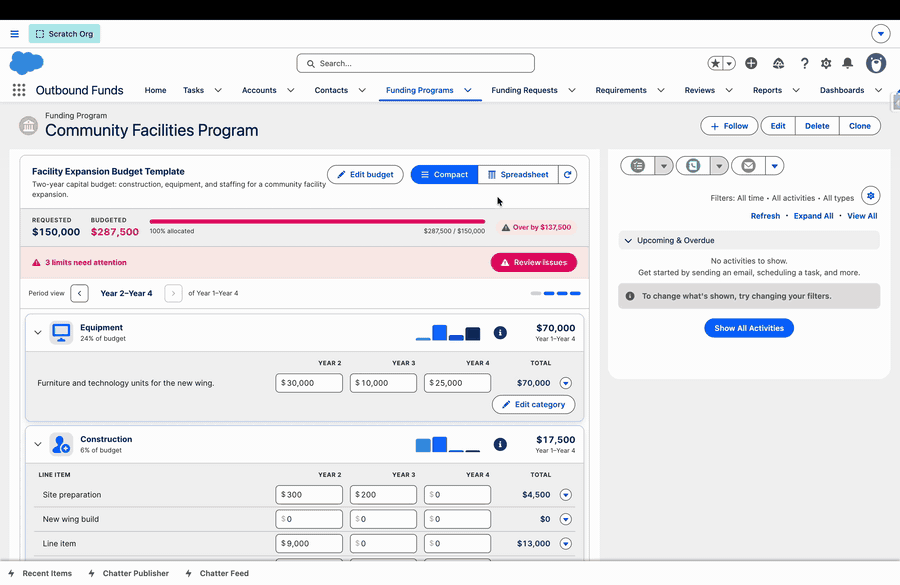
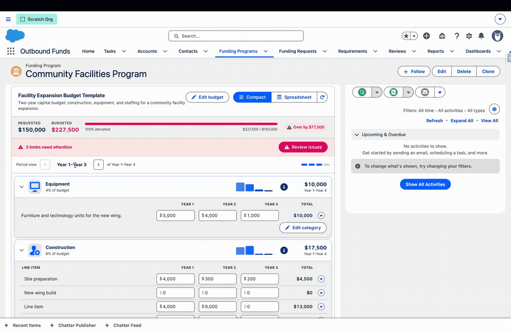
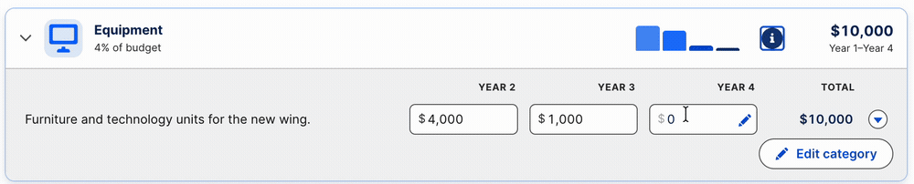
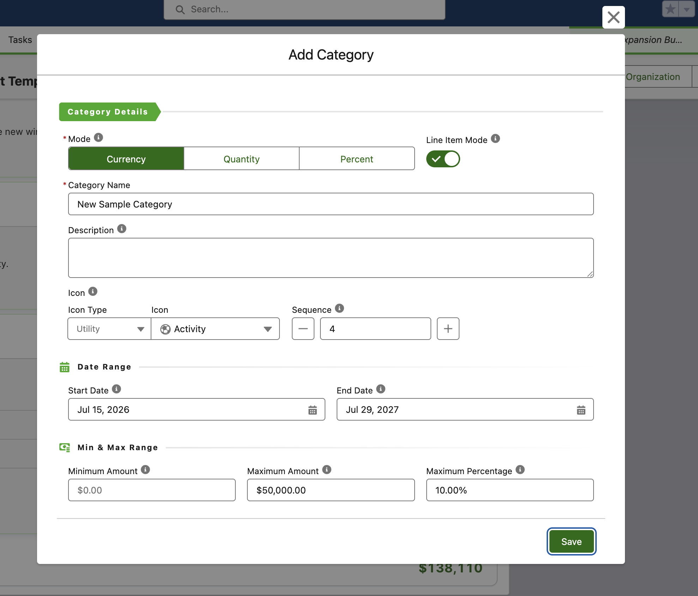
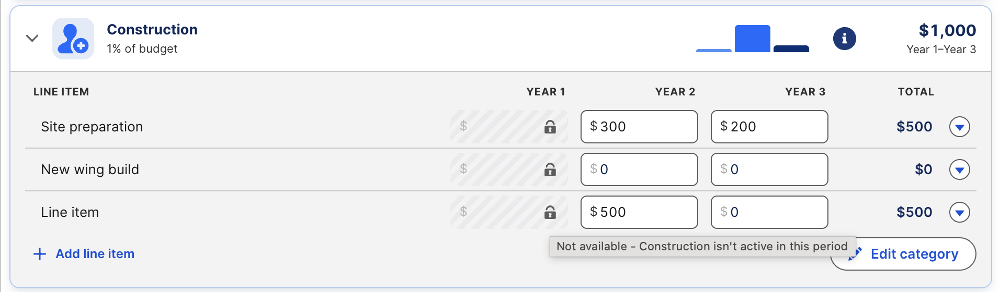
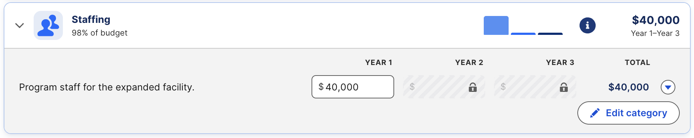
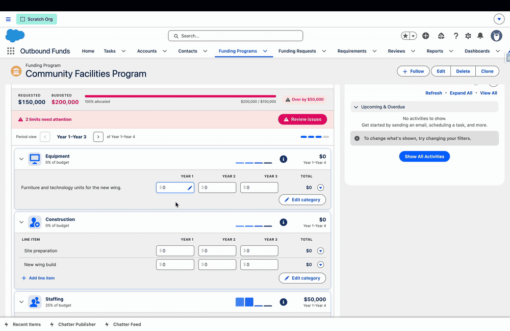
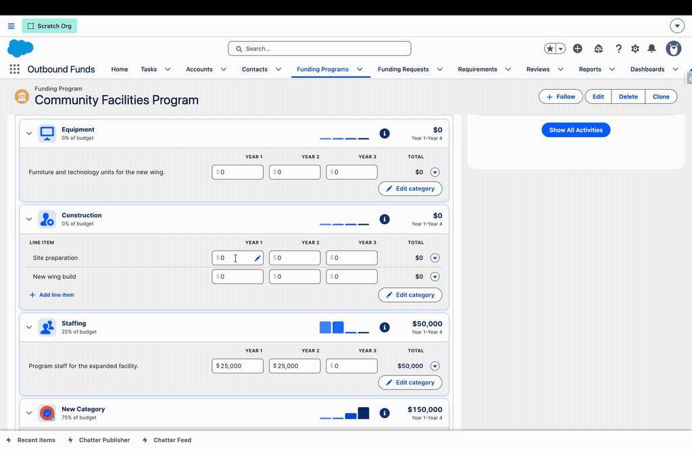
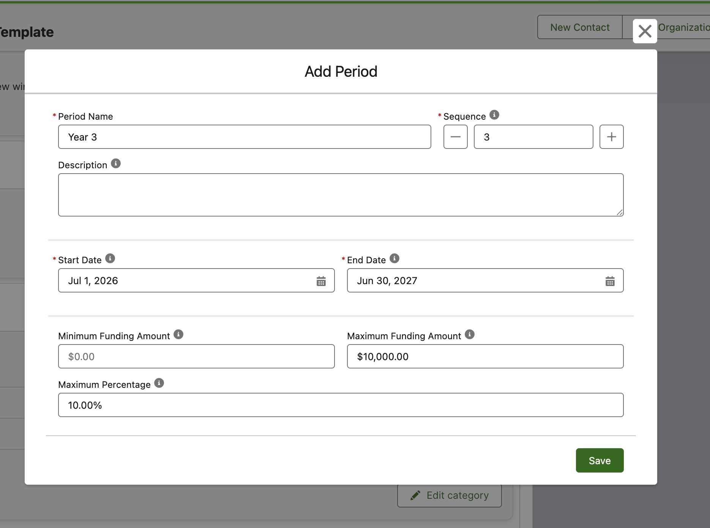

# The Budget Grid & Value Modes

The grid lays categories out as rows and periods as columns. Every intersection is a value cell. This page covers how people read and edit the grid day to day.

## Compact and spreadsheet views

Toggle between two layouts with the **Compact / Spreadsheet** switch in the header.

- **Compact** — each category is a collapsible card showing its line items, a spend bar, and its total. Best for reading a budget and working one category at a time.
- **Spreadsheet** — a dense table with periods as columns and a totals row, closest to a classic budget worksheet. Best for entering many numbers quickly.

Both views share the same paginator: when a budget has more than three periods, the extra columns page rather than crowd the screen, so a monthly or quarterly budget stays readable.

## Entering values

Type directly into a cell and it saves as you go, with per-cell save sequencing so a slow save can never overwrite a newer edit. A spend bar on each category header shows how the money ramps across periods at a glance.

Cells that don't apply are locked. If a category's start and end dates exclude a period (see below), that cell is hatched and cannot be edited — the budget only accepts values where the category is actually valid.

## Categories

A category is a row. Staff with the *Configure Budget Templates* permission can **Add category** and **Edit category**. A category carries:

- **Name** and **description**.
- An **icon** — any icon from the Salesforce Lightning Design System; it updates instantly and helps each category read at a glance.
- A **sequence** that controls display order. Change a category's position and the others renumber automatically to stay gapless.
- **Line item mode** (see below).
- A **value mode** and its limits (see [Value modes](#value-modes) and [Limits, Validation & Reporting](limits-validation-and-reporting.md)).
- Optional **start and end dates** that scope which periods it applies to.

### Category validity by date

A category's start and end dates decide which periods it can be budgeted in. Give a category a start date in Year 3 and its Year 1 and Year 2 cells lock — the grid won't let money land in periods the category isn't active for. This keeps multi-year budgets honest when programs phase in or out.

## Line items

Turn on **line item mode** for a category and it holds specific line items instead of a single amount per period. A Construction category, for example, can break into *Site preparation*, *New wing build*, and *Cleanup*, each with its own values across periods.

- **Add line item** adds a row within the category.
- **Clone** a line item to duplicate its shape quickly.
- **Split evenly** takes a total and distributes it across the periods for you.
- **Clear** resets a row; **Delete** removes it.

Line items roll up to the category total for reporting, while preserving the detail underneath — you see both "Construction: $130,000" and how that splits across site prep, the new wing, and cleanup. A category without line item mode simply holds one value per period.

## Attachments on line items

Every cell carries **one** action icon, and it always opens the same thing: the edit form you mapped for that object. What changes is the glyph, so the grid tells a grantee what the line needs before they open it.

Map a category's **Requires Estimate** checkbox and its authoring cells show an attachment icon instead of the pencil, the sign that this line wants a quote behind the number. Map **Requires Receipt** and the same swap happens on reporting and claim sheets, where the document owed is proof of spend rather than a quote. Both open the ordinary edit form; you decide what is inside it, and dropping the base package's file upload field into that form is what lets someone type the figure and attach the document in one place.

Map the matching **FileUpload** field and the icon lights once the record holds files, so reviewers spot documented lines at a glance. Estimates and receipts are separate fields, and each surface reads the one it demands: the authoring grid asks for estimates, a Direct reporting sheet asks for receipts, and a claim sheet asks the claim line rather than the value.

A required document that is missing is treated as a breach, not a hint. A cell carrying money in a Requires Estimate category with nothing uploaded turns its icon **red** and raises an issue in the issue bar, counted alongside every limit breach and reported to Flow through `hasViolations` and `violationCount`, so a submit Flow can refuse a budget that still owes quotes. The message is **grouped**: one issue covering every cell that owes a document, because the fix is the same everywhere and a per-cell list would bury the limit breaches above it. Reporting and claim sheets do the same against Requires Receipt, keyed on the figure actually claimed or spent, and show their own advisory line that expands to name the rows. On a cell backed by a record the icon stays visible without hovering, sized to the figure beside it; an empty cell reveals it on hover or focus. Guests never get the icon, since a public site is read-only, and neither does a cell backed by more than one record: there is no single record for the form to open.

## Value modes

Not every budget is money. Each category can use one of three modes so the same grid tracks financial and non-financial goals side by side:

- **Currency** — dollar amounts (the default).
- **Quantity** — counts, for goals like "plant 200 trees" or "deliver 50 kits."
- **Percent** — proportions, for goals like "50% of outreach this quarter." Percent rows are capped at 100% across their periods.

Modes mix freely within one budget: a program budget can have currency categories, a quantity category for units delivered, and a percent category for allocation, all at once.

<!-- image pending: 33-value-modes.png — A budget mixing currency, quantity, and percent categories -->

## Periods

A period is a column. With the manage permission you can **Add period** and edit periods. A period carries a **name** (e.g., "Fiscal Year 2027"), a **sequence/position**, optional **start and end dates**, and a **maximum funding amount** that feeds validation. As with categories, changing a period's position renumbers the rest to stay gapless.

### Scoping periods with budget dates

Map the budget's **start and end date** fields and the grid stops showing periods that fall outside
that window, so a five-year template attached to a two-year grant renders two columns, not five.
Three rules keep it safe:

- **Only empty periods hide.** A period holding any non-zero figure stays visible and editable, and
  the header flags it: *Holds amounts outside the budget's start and end dates. Clear them, or widen
  the dates.* That flag also counts toward the **Has Violations** / **Violation Count** Flow outputs,
  so a submit Flow can refuse a budget whose money sits outside its dates.
- **Getting back in line is a normal edit.** Clear the out-of-range cells to zero and the column
  drops off on the next load, taking the flag with it.
- **A sheet opened for a specific period always renders**, even if that period is outside the window.

Overlap counts: a period is in range if any part of it falls inside the window. With both date
mappings blank, nothing changes and every period shows.

#### Where the dates come from

The date fields are **yours**, mapped through the configuration. The intended pattern: an applicant
states a start and end date on their application, and your org carries those onto the budget with a
**formula field** or **automation**. Two things to know when you wire that up:

- **A formula cannot be validated at save time.** A formula recalculates on read; there is no save on
  the budget to intervene on. If you need enforcement, write the dates to real fields with automation
  instead.
- **When automation writes the dates, guard the cut-off case.** Narrowing the window can strand a
  value greater than zero in a period that is now out of range. The grid will keep that money visible
  and flag it (it never blocks), but if you want to stop the date change itself, use a **before-save
  record-triggered flow on the budget with a Custom Error element**: a plain validation rule cannot
  query the budget's values, a flow can. Have it find values above zero whose period falls outside
  the new dates, and block the save with a message naming them.
