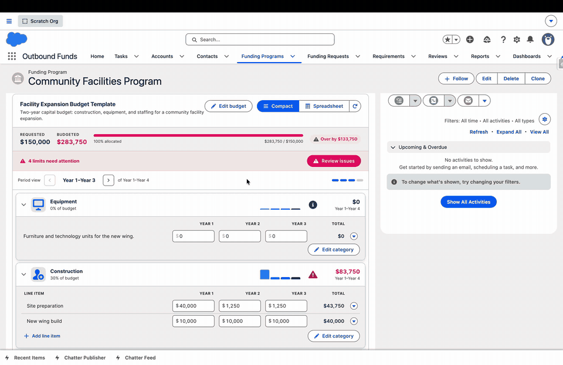
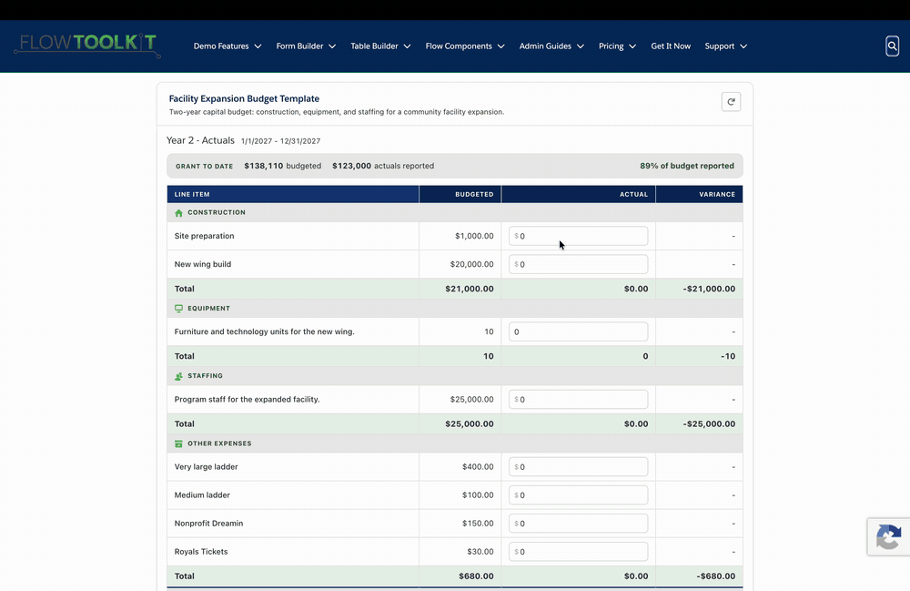

# Limits, Validation & Reporting

The grid enforces guardrails as people type and, in reporting mode, tracks actual spend against the plan. Validation is always advisory — it flags problems clearly but never blocks saving, so a grantee is never stuck mid-entry.

## Limits you can set

Limits live at three levels and feed the same validation system:

- **Category** — minimum amount, maximum amount, a **maximum percentage** (the category may not exceed that share of the total budget), and minimum/maximum quantity for quantity-mode categories.
- **Period** — a **maximum funding amount** for everything budgeted in that column.
- **Budget** — an overall requested amount, minimum, and maximum. The overall requested amount typically mirrors the amount on the related grant or request.

Set these on the budget, category, and period edit forms. Leaving a limit blank means "no limit."

## How violations surface

As values change, the grid re-checks every limit:

- A cell or category **at or over** a limit shows a red advisory.
- One **approaching** a limit shows a yellow advisory with the remaining headroom (for example, "$1 left before the maximum").
- The header shows a running count — **"N limits need attention"** — with a **Review issues** button.

<!-- image pending: 33-advisory-chips.png — A category over its maximum, with the advisory chip -->

**Review issues** opens a checklist of every current problem across the whole budget at once — the overall budget over its maximum and its requested amount, a category over its percentage cap, a period over its maximum — so an admin or grantee can see everything to fix in one place.

You can also click any category to see its start date, end date, and any limits that apply to it, without opening the edit form.

### Violations as data on the budget

Map the three violation fields and the package **stamps the same list onto the budget record**
whenever a value is created, changed or deleted: a checkbox (any breach?), a count, and a long text
carrying one breached limit per line in your org's default language, worded exactly like the Review
issues list. Removing the row that caused a breach clears the flag.

The package never blocks anything with these fields - that is the point. They turn violations into
plain data, so **you** decide what "not allowed" means with the tools you already have:

- a validation rule on the budget: `Has_Violations__c = false` required before Status can change to
  Submitted
- a record-triggered Flow that emails the program officer when the count rises
- list views and reports over budgets with breaches

On NPC and Outbound Funds the bundled configuration maps all three out of the box, and the bundle's
record-triggered flows keep them current.

Missing **estimates** count here too: a cell carrying money in a Requires Estimate category with nothing uploaded is one grouped violation on the stamp, so a submit Flow can refuse a budget that still owes quotes. Missing **receipts** are deliberately absent from the stamp: a receipt belongs to one claim, not to the budget this field describes, and the claim sheet reports it there instead.

## Requested vs. budgeted

The header contrasts **Requested** (what the grant or request is for) with **Budgeted** (what the categories currently add up to), plus an allocation bar and an over/under indicator. This is the fastest read on whether a budget is balanced.

## Reporting mode (budget vs. actuals)

Point the component at a budget **period** record instead of the whole budget and the grid flips into **reporting mode** — an actuals-entry grid for that period. Point it at a **disbursement** record (with the disbursement role mapped) and the same sheet opens for that disbursement's period; on a budget in Allocation mode it becomes a claim sheet, see [Claims & Allocation Mode](claims-and-allocation-mode.md).

> **See it live:** [Year 2 reporting window](https://common-unite.my.site.com/s/budget/a0rRQ00000pF7dPYAS/year-2) — budgeted vs. actual vs. variance on a public demo site.

- Each line item shows **budgeted**, **actual**, and **variance** side by side.
- A cumulative, grant-to-date strip tracks spend across periods: budgeted vs actuals reported, or budgeted vs claimed on an Allocation-mode budget.
- Categories over their variance threshold are flagged for review. The threshold is configurable per budget.

### Submitted periods lock

When a period is marked submitted, its reporting grid becomes read-only — the component reads the mapped "submitted" flag and never writes it, so *how* a period gets submitted stays in your org's own workflow (a Flow, an approval, a button). Once submitted, actuals for that period are locked from further edits.

<!-- image pending: 33-submitted-lock.png — A submitted period, locked read-only -->
