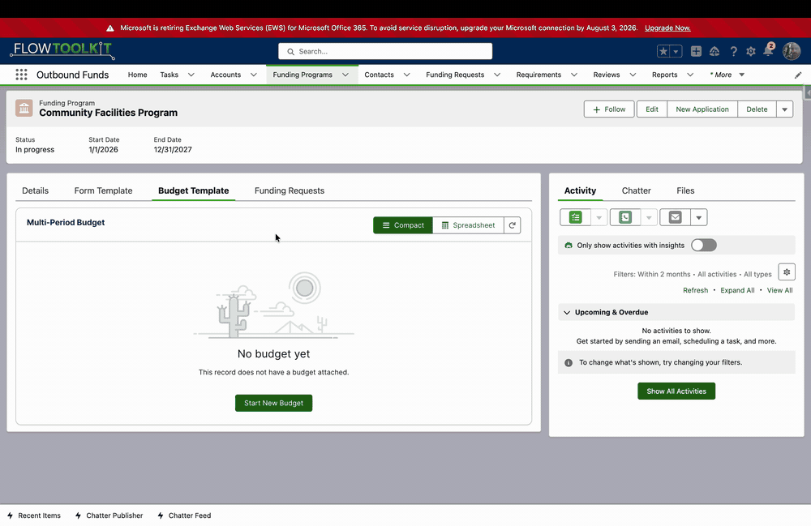

# Templates & Cloning

Most programs budget the same way every time. Rather than rebuild a budget per applicant, you build it once as a **template** and clone it onto each new application or funding request.

## Budget templates

A template is just a budget you treat as a starting point — its categories, periods, value modes, icons, limits, and even seeded amounts. In the Outbound Funds example, a **Funding Program** holds a budget template, and every funding request under that program starts from it.

Because a template is an ordinary budget, you build and edit it with the same grid and forms as any other budget. See [The Budget Grid & Value Modes](budget-grid-and-modes.md).

When a record has no budget yet, the grid offers **Start New Budget** — creating the budget straight from the record (here, a Funding Program) and attaching it, so you can build the template in place.

## The Clone Budget action

**Clone Budget** is an invocable action you can call from Flow. Given a template budget's Id, it deep-clones the whole tree — the budget, its categories, its periods, and its values — and rewires every lookup and grouping identifier so the new budget is fully independent of the template.

It works against whatever object model your configuration maps, so the same action clones NPC budgets, Outbound Funds budgets, or your own.

### A graceful contract

The action never throws into its caller. It returns **Is Success** and **Error Message** outputs instead, so a record-triggered flow that clones a budget as part of a larger transaction is never rolled back by a clone problem — the flow can branch on the result and carry on.

## Auto-clone on create

Pair Clone Budget with a record-triggered flow to stamp a fresh budget onto each new application or request automatically. Ready-made After-Create flows ship for both models:

- **NPC Grantmaking** — clone a template onto a new application.
- **Outbound Funds** — clone the funding program's template onto a new funding request.

The new record links to its own budget, and the grantee opens it already populated with the program's structure, ready to fill in.

> **Deploying to production orgs:** record-triggered flows install as *Draft* in production (scratch orgs auto-activate). The install flows activate them for you; if you deploy manually, remember to activate the clone and automation flows.
