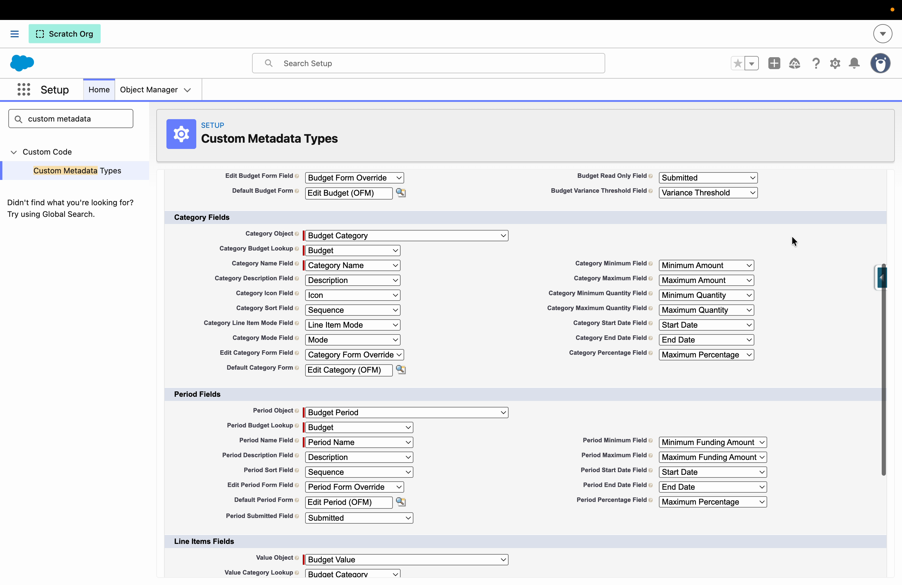

# Quickstart

This guide takes you from a fresh install to a working budget grid. It uses **Outbound Funds** as the example, but the same steps apply to NPC Grantmaking or your own custom objects — only the object names change.

The grid always renders against a **budget record**. An admin maps that budget (and its categories, periods, and values) once through a configuration record, then places the component wherever grantees or staff need it.

## 1. Install and assign access

1. Install the base Flow Tool Kit package, then the Universal Budget package (see [Installation](installation.md)).
2. Assign **Form (Universal Budget User)** to anyone who should see and use a budget.
3. Assign **Form (Universal Budget Template Manager)** to admins who should build and edit budget structure (categories and periods). This permission set carries the *Configure Budget Templates* custom permission that reveals the structure-editing buttons.

## 2. Pick your data model

You need four objects: a **budget**, its **categories** (rows), its **periods** (columns), and its **values** (cells).

- **NPC Grantmaking** — use the standard Budget, Budget Category, Budget Period, and Budget Category Value objects.
- **Outbound Funds** — deploy the bundled `unpackaged/config/ofm` config, which adds a custom `Budget` tree and a lookup from Funding Request and Funding Program to a budget.
- **Your own objects** — any four objects with the right lookups work. See [Mapping Your Data Model](../configuration/mapping-your-data-model.md).

## 3. Map the model with a Budget Configuration record

Create one `Budget_Configuration__mdt` record that tells the component which objects and fields to use — which object is the budget, which field on a value holds the amount, which field marks a period submitted, and so on. This mapping is what makes the grid work against your model without code.

The bundled NPC and Outbound Funds configs are complete, working examples. Full field-by-field detail is in [Mapping Your Data Model](../configuration/mapping-your-data-model.md).

## 4. Connect a request to a budget (optional but common)

In a grant workflow you rarely open a bare budget — you open an application or funding request and want *its* budget. Two patterns:

- **Lookup on the record** — add a lookup to the budget object on your request object, then place the component on the request page and point it at that lookup (the *Related Field Api Name* property, which can hop up to two levels, e.g. Funding Request → Funding Program → Budget Template).
- **Auto-clone on create** — stamp a fresh budget onto each new request from a template. See [Templates & Cloning](../features/templates-and-cloning.md).

In the Outbound Funds example, a **Budget Template** tab is added to the Funding Program, the component is placed on it, and each funding request pulls its budget from the program's template.

## 5. Add the component to a page

In Lightning App Builder, drag **Universal Budget** onto a record page or tab.

- On a **budget** record page, the grid loads that budget automatically.
- On a **parent** record page (a request or program), set the *Related Field Api Name* property to the lookup that reaches the budget.
- Optionally set brand and complementary colors to match your org or Experience site.

## 6. Open a budget

Open the record. Categories appear as rows, periods as columns, and every cell is editable. Staff with the Template Manager permission see **Edit budget**, **Edit category**, **Add category**, and **Add period** controls; everyone else sees a clean, read-only-structure grid they can still enter values into.

<!-- image pending: 33-grid-first-view.png — The grid rendered with categories, periods, and inline value cells -->

## Where to next

- [The Budget Grid & Value Modes](../features/budget-grid-and-modes.md) — how staff and grantees actually use the grid.
- [Limits, Validation & Reporting](../features/limits-validation-and-reporting.md) — set guardrails and track actuals.
- [Mapping Your Data Model](../configuration/mapping-your-data-model.md) — the full configuration reference.
