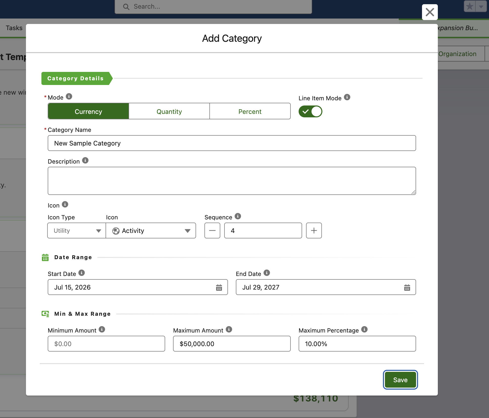
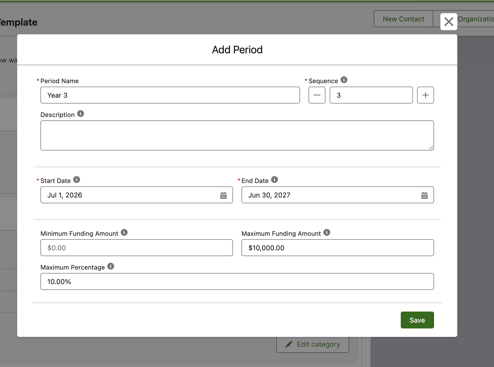

# Forms, Flow & Experience Cloud

The grid is one surface; these are the ways it connects to the rest of your org — the forms that edit structure, the Flow screen contract, and Experience Cloud for grantees.

## Form-driven structure editing

Every **Edit budget**, **Edit category**, **Edit period**, and per-cell edit opens a Flow Tool Kit **Form Builder** form, not a hard-coded dialog. You build those forms against your budget objects, so you decide exactly which fields an admin edits and how they're laid out.

The forms below are the **defaults** that ship with the NPC and Outbound Funds bundles. They're ordinary Form Builder forms, so you can add, remove, or rearrange any fields — including your own custom fields — per object and per budget.

Because the forms are configured, not coded:

- A budget form can expose overall minimum, maximum, start date, and end date.
- A category form can expose name, description, icon, mode, limits, and date range.
- **Different budgets can use different forms.** The configuration maps a default form per object, and a field on the budget can override it — so a capital budget and a program budget can each offer a tailored edit experience. See [Mapping Your Data Model](../configuration/mapping-your-data-model.md#edit-forms).

Structure editing (adding and editing categories and periods) is gated by the **Configure Budget Templates** custom permission, which comes with the *Form (Universal Budget Template Manager)* permission set. Users without it still enter values — they just don't see the structure controls.

## Flow screen contract

Drop the component onto a **Flow screen** and it participates in the flow:

- **Record Id** (input) — the budget, or a period record to open reporting mode. Bind a record variable's Id.
- **Has Violations** (output) — true while any limit is exceeded.
- **Violation Count** (output) — how many limits are exceeded.

Use the outputs to gate navigation — for example, keep a grantee on the budget screen until **Has Violations** is false, so an application can't be submitted over budget.

You can also set **brand** and **complementary** colors on the component to match your flow or site.

## Experience Cloud

The component runs in Experience Cloud sites, so grantees can view and work their budget in a portal.

- On a record page, it binds `{!recordId}` from the page automatically. On a standalone page, set the Record Id to a specific budget.
- **Grantees** (portal members) see a focused grid: no **Edit budget**, **Edit period**, or **Edit category** buttons, because they don't hold the manage permission. If you give them value access, they can still enter amounts and add detail to line items — clarifying a specific ask without touching the budget's structure.
- Set the brand color to match your site.

### Guest interactive preview

On a **public (guest) page**, the grid becomes an interactive **preview**. A guest can change values and add, rename, clone, or delete line items, and the grid responds live — but nothing is written to the database. Salesforce never lets guest users update records, so rather than a dead read-only grid, a public visitor gets the real editing feel; edits simply reset on refresh.

> **Try it yourself:** [Facility Expansion Budget Template](https://common-unite.my.site.com/s/budget/a0tRQ00000YpZ3PYAV/facility-expansion-budget-template) — change values and add line items as a guest; your edits reset on refresh.

Enabling a guest to *view* budgets also requires giving the site's guest user read access and Apex class access via the guest permission set, plus a guest sharing rule on the budget object. The bundled Outbound Funds guest permission set includes the class access; the sharing rule is org-specific.
